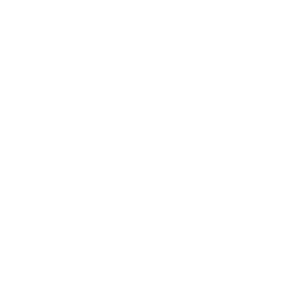

# ENGLISH

# EcoPoints - Sustainable Recycling Web Application

## Project Description

"EcoPoints is a web application designed to encourage recycling and reward users for their participation in sustainable activities. We offer a points tracking and rewards system for proper recycling. Recycling data is analyzed, and statistics are displayed to users. Accumulated points can be redeemed for discounts, items, tickets, and more."

## Key Features

- **Recycling with EcoPoints:** Users can earn points by using the smart containers developed by GreenTech. Every time they scan the QR code on a container while depositing waste, they receive 1 point in their account.

- **Personalized Rewards:** Users can redeem their accumulated points for discounts, items, tickets, and more at a wide range of affiliated establishments.

- **Statistics and Progress:** The main application screen displays user statistics, including the total number of deposits made in different containers. Users can also track their recycling progress for the last week and month.

- **Environmental Education:** Coming soon, we will implement an educational section to raise awareness about sustainable practices and promote a positive impact on the environment.

- **Community and Forum:** Coming soon, users will have the opportunity to interact through a forum where they can communicate and share their concerns, issues with containers, or suggestions to improve the system.

- **Statistical Studies:** GreenTech will conduct internal statistical studies using Data Science to analyze users' recycling habits. These studies will provide valuable information to municipalities regarding sustainable practices.

## Technologies Used

- **Front-End:** The Front-End of the application has been developed using React, Tailwind, and Vite to provide a fast and enjoyable user experience.

- **Back-End:** The Back-End utilizes Node.js, Express, and Sequelize to manage logic and communication with the MySQL database.

- **Data Science:** For statistical analysis, we have employed Python and Anaconda, making use of libraries such as Numpy, Pandas, and Matplotlib, Scikit-Learnand; for the graphs, the Chart.js, Plotly libraries have been used.

## Registration Requirements

"To provide a personalized experience, the following information will be required during registration:

- Email address.
- Name and phone number.
- User location (city/town).
- Recycling areas in their home (different types of waste they have)."

## Privacy and Data Protection Policy

"GreenTech is committed to ensuring the privacy and security of user data, complying with all applicable data protection regulations and policies. The data collected will be used to improve the service and conduct internal studies on recycling habits. Optional user-provided data, such as age, gender, marital status, children, type of housing, city, province, education level, and profession, will be used for statistical purposes only and always anonymously."

## Contributions

"This project has been developed by GreenTech. However, if you are interested in contributing or have any suggestions, we would be delighted to receive your feedback and improvements.

Join us on this journey towards a more sustainable and eco-friendly future!"

---

## Team

- Front: Nestor Oliveras
- Back: Daniel Benítez
- Data: Daniel Casanovas

*Note: This is a general description of the EcoPoints project. Some details may be subject to changes or updates during development and implementation.*

---------------------------------------------------------------------------------------------------------------------------------------------

# EcoPoints - Aplicación Web para el Reciclaje Sostenible

## Descripción del Proyecto

"EcoPoints es una aplicación web para incentivar el reciclaje y recompensar a los usuarios por su participación en actividades sostenibles. Ofrecemos un sistema de seguimiento de puntos y recompensas por reciclaje adecuado. Se analizan los datos de reciclaje y muestra las estadísticas a los usuarios; los puntos acumulados podrán canjearse por descuentos, objetos, entradas, y más."

## Características Principales

- **Reciclaje con EcoPoints:** Los usuarios pueden acumular puntos al utilizar los contenedores inteligentes desarrollados por GreenTech. Cada vez que escanean el código QR en un contenedor al depositar residuos, reciben 1 punto en su cuenta.

- **Recompensas Personalizadas:** Los puntos acumulados por los usuarios pueden canjearse por descuentos, objetos, entradas y más en una amplia variedad de establecimientos asociados.

- **Estadísticas y Progreso:** La pantalla principal de la aplicación muestra las estadísticas del usuario, incluido el número total de depósitos realizados en diferentes contenedores. También se puede ver el progreso de reciclaje durante la última semana y mes.

- **Educación Ambiental:** Próximamente, se implementará una sección educativa para concienciar a los usuarios sobre prácticas sostenibles y fomentar un impacto positivo en el medio ambiente.

- **Comunidad y Foro:** Próximamente, los usuarios tendrán la oportunidad de interactuar a través de un foro donde podrán comunicarse y compartir sus inquietudes, problemas con los contenedores o sugerencias para mejorar el sistema.

- **Estudios Estadísticos:** GreenTech llevará a cabo estudios estadísticos internos mediante Data Science para analizar los hábitos de reciclaje de los usuarios. Estos estudios proporcionarán información valiosa a los ayuntamientos sobre prácticas sostenibles.

## Tecnologías Utilizadas

- **Front-End:** El Front-End de la aplicación ha sido desarrollado utilizando React, Tailwind y Vite para proporcionar una experiencia de usuario rápida y agradable.

- **Back-End:** En el Back-End, se ha empleado Node.js, Express y Sequelize para gestionar la lógica y la comunicación con la base de datos MySQL.

- **Data Science:** Para los análisis estadísticos, se ha utilizado Python y Anaconda, aprovechando las librerías Numpy, Pandas y Matplotlib, Scikit-Learn; y para las gráficas, se ha empleado las librerías de Chart.js, Plotly.

## Requisitos de Registro

"Para brindar una experiencia personalizada, se requerirá la siguiente información durante el registro:

- Dirección de correo electrónico.
- Nombre y número de teléfono.
- Ubicación del usuario (ciudad/pueblo).
- Áreas en su hogar destinadas al reciclaje (diferentes tipos de basura que tienen)."

## Política de Privacidad y Protección de Datos

"GreenTech se compromete a garantizar la privacidad y seguridad de los datos de los usuarios, cumpliendo con todas las regulaciones y políticas de protección de datos aplicables. Los datos recopilados serán utilizados para mejorar el servicio y realizar estudios internos sobre los hábitos de reciclaje. Los datos opcionales proporcionados por los usuarios, como edad, género, estado civil, hijos, tipo de vivienda, ciudad, provincia, nivel de estudios y profesión, serán utilizados con fines estadísticos y siempre de forma anónima."

## Contribuciones

"Este proyecto ha sido desarrollado por GreenTech. Sin embargo, si estás interesado en contribuir o tienes alguna sugerencia, estaremos encantados de recibir tus comentarios y mejoras.

¡Únete a nosotros en este viaje hacia un futuro más sostenible y ecológico!"

---

## Equipo

- Front: Nestor Oliveras
- Back: Daniel Benítez
- Data: Daniel Casanovas

*Nota: Esta es una descripción general del proyecto EcoPoints. Algunos detalles pueden estar sujetos a cambios o actualizaciones durante el desarrollo y la implementación.*

